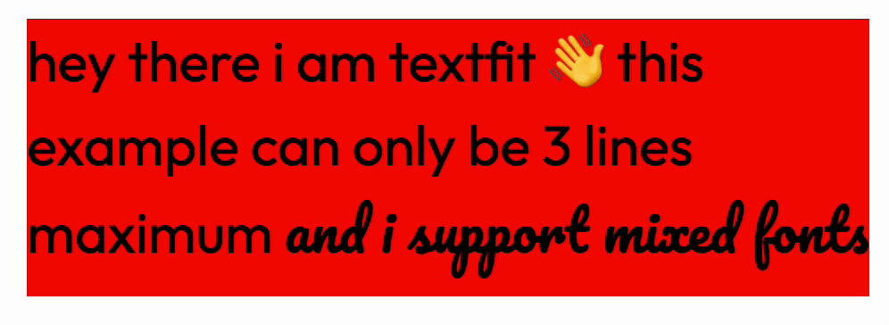

[](https://textfit.page.bne.sh/)

# textfit

[](https://badge.fury.io/js/textfit-web-component)

This package only needs to be imported once as web components extend the HTML object. You can use this just like a `div` or `h1` tag after you import the module

## usage examples

```html
<script type="module">import "./node_modules/textfit-web-component/textfit.js"</script>
<!-- or -->
<script type="module" src="https://cdn.jsdelivr.net/npm/textfit-web-component@1.0/textfit.js"></script>

<body>
    <div>
        <text-fit max-lines="1">
            hello world
        </text-fit>
    </div>
</body>
```

you can also use this in a framework like react as long as it's imported before it's used since it's just adding a new html tag to the dom. This can be in the html file, top level index.js entry point or even in the same file.

```jsx
import 'textfit-web-component'

const ReactComponent = () => {
    return (
        <div>
            <text-fit max-lines="1">
                hello react world
            </text-fit>
        </div>
    )
}
```

## Props

| Props    | Description | Default value |
|----------|-----|-----|
| max-lines | The maximum number of lines that should be allowed to be rendered. The font size will reduce until it hits the minimum font size. | undefined |
| max-height | The maximum that the element should be allowed to be before the font size gets reduced. The possible values are `parent`, `outerbox`, `innerbox`, `css`, `self`, or a integer in pixels. The font size will reduce until it fits or the min font size is hit | undefined |
| max-font-size | The maximum allowed font size that the resizing can set to | 100 |
| min-font-size | The minimum allowed font size that the resizing can set to | 20 |
| font-unit | The unit that the font size should be set to. This can be any valid css unit | % |
| classname | The class name that should be applied to the element | undefined |
| log-overflow-error | If the text is too large to fit in the element then it will log an error message for debugging | false |
| debounce-time | The amount of time in milliseconds that the resize event should be debounced by | 0 |
| dont-grow-in-height | Prevent the element from getting larger than its initial size. This can create problems as if you resize the initial size will become the current size meaning it'll never grow in size | false |
| disable-dynamic-font-size | Disable the dynamic font size and only use this for line counting | false |

## Advanced examples 🫶

if you want a element to be based of the hight of something else then you can use the max-height props. There is a range of different max height limiters that have been provided in order to allow their system to work in all use cases.

```html
`parent` It sets the max height based on if this element is larger than its direct parent. 
<div style="height: 20px;">
    <text-fit max-height="parent">
        max height based on parent
    </text-fit>
</div>
```

`Outerbox` lets you check if this element is larger than its parent using a bounding box.

```html
<div style="height: 30px;">
    <text-fit max-height="outerbox">
        max height based on parent's bounding box
    </text-fit>
</div>
```

`innerbox` lets you check if any child element is larger than the textfit element. This is useful in situations where you have elements other than text also inside the component.

```html
<text-fit max-height="innerbox">
    <i class='icon'/>
    max height based on parent's bounding box
</text-fit>
```

`self` Checks if the element's scroll height is larger than its height. This is a classic overflow where scroll bars would appear.

```html
<text-fit max-height="self">
    max height based on bounding box of the element inside 
</text-fit>
```

`css` This is the default value. It will use the css height value that has been set on the element. This is useful if you want to set a max height in css and then use that value.

```html
<style>
    .textbox {
        max-height: 200px;
    }
</style>
<text-fit max-height="css" classname="textbox">
    max height based on css max-height value
</text-fit>
```

You can also pass in a integer in order to set a manual max height

```html
<div style="height: 200px;">
    <text-fit max-height="300">
        max height is 300px 
    </text-fit>
</div>
```

you can use both max-height and max-lines together. This will allow you to set a max height and then have the text fit into that max height by reducing the font size. This is useful if you want to have a title that is a maximum of 3 lines but also stays withing the bounds of the parent element.

```html
<h2 style="background: red; height: 50vh; ">
  <text-fit max-lines="3" max-font-size="2000" max-height='outerbox' >
  hey there i am samuel
  </text-fit>
</h2>
```

if you just want to use textfit for line counting you can disable the font resizing with the `disable-dynamic-font-size` prop

```html
<text-fit disable-dynamic-font-size id="target">
    hello
</text-fit>

<script>
    document.querySelector('#id').lineCount; // 1
</script>
```

---
Thanks for reading. Please let me know if you find this useful or if you need any changes done ❤️

i also made a URL shorter that just uses emojis [https://bne.sh/🇨🇻🥩](https://bne.sh/🇨🇻🥩)
